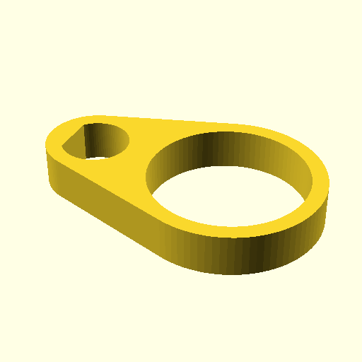

# Eyelet for VO&S spinningwheel

Designer Sebastiaan Vos had his own ideas about spinning wheels and designed
and built a tower model spinning wheel stripped to its essence, with a few
clever details that show Vos really understands the craft of fiber spinning.

I found my own one in a kringloop, with only one bobbin and pieces of hardware
for leading the yarn along the flight. After a short while things started
falling off and breaking and it became apparent that I needed to come up with
something better.

So here is the openscad script to generate an stl file. When slicing, fill it
100% to prevent breaking. There's some forces involved when spinning yarn.



You need to balance the flight with M6/M7washers and M7 nuts. Being a tower
model, any unbalance in the top will be amplified on the floor. Your neighbours
will notify you if you forget.  Think 90's harddisk in top of your maxi tower
pc.  Balancing can be done with M6/M7washers and M7 nuts. Keep the weights
between 2 eyelets.

Thickness can be adjusted with variable 'hoogte'
Yarn ring size can be adjusted with variable 'ring_id'

# generate STL file

```
  $ make
```

# bc script to figure out what's what with triangles and parallels

I adapted some code from https://unixwars.blogspot.com/2016/03/joining-two-circlescylinders-in.html
and used below bc script to get things right.

```bc
define asin(x) {
  if(x==1) return(pi/2)
  if(x==-1) return(-pi/2)
  return(a(x/sqrt(1-(x^2))))
}

vlucht_dia=6.5
vlucht_vlak=.5

bus_dikte=3
bus_id=vlucht_dia
bus_od=bus_id+bus_dikte

ring_dikte=bus_dikte
ring_id=15
ring_od=ring_id+ring_dikte

c2c = (bus_od+ring_od)/2

r1 = bus_od/2
r2 = ring_od/2

a1 = c2c*r2/(r2 - r1)
alpha = asin(r2/a1)
#    alpha = asin((r2+r1)/(r2-r1))
x1 = r1*s(alpha)
y1 = r1*c(alpha)
x2 = c2c-r2*s(alpha)
y2 = r2*c(alpha)
```
