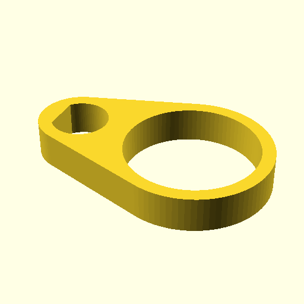
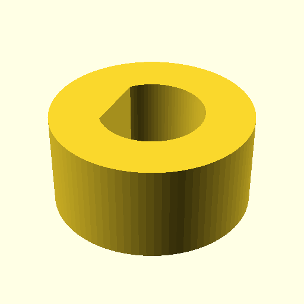
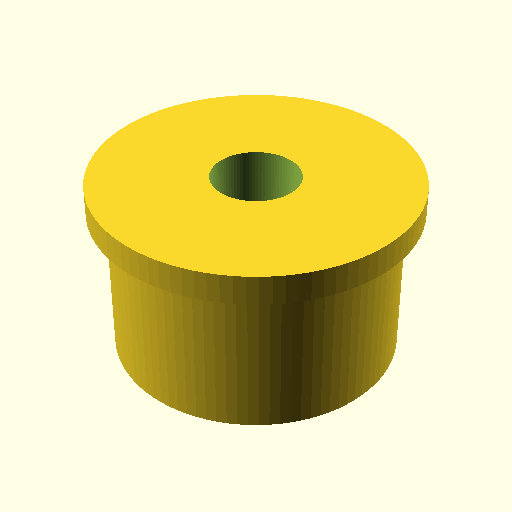
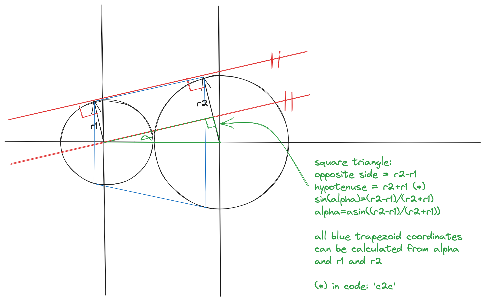

# Parts for VO&S spinningwheel

Designer Sebastiaan Vos had his own ideas about spinning wheels and designed
and built a tower model spinning wheel stripped to its essence, with a few
clever details.

I found my own VO&S in a kringloop, with only one bobbin. The flight had random
bits of hardware for leading the yarn on the bobbin. After a short while things
started breaking and ergonomics wheren't great so I came up with this.

So here is the openscad script to generate an stl file. Use 100% infill when
printing to make the part more robust. There's some forces involved when
spinning yarn.



You need to balance the flight with M6/M7washers and M7 nuts. Being a tower
model, any unbalance in the top will be amplified on the floor. Your neighbours
will notify you if you forget to balance. Think 90's harddisk in top of your
maxi tower pc.  Balancing can be done with M6/M7washers and M7 nuts. Keep the
weights between 2 eyelets.

Thickness can be adjusted with variable 'hoogte'
Yarn ring size can be adjusted with variable 'ring_id'

## part to keep balance weights in place

Obviously based on the eyelet.



## bushing for double drive

A mystery part was missing from the double drive. According to the
measurements it could have been something like this



# generate STL files

```
  $ make
```

# bc script to figure out what's what with triangles and parallels

I studied https://unixwars.blogspot.com/2016/03/joining-two-circlescylinders-in.html
and used below bc script to get things right. The sketch I used was made in
excalidraw.



```bc
define asin(x) {
  if(x==1) return(pi/2)
  if(x==-1) return(-pi/2)
  return(a(x/sqrt(1-(x^2))))
}

vlucht_dia=6.5
vlucht_vlak=.5

bus_dikte=3
bus_id=vlucht_dia
bus_od=bus_id+bus_dikte

ring_dikte=bus_dikte
ring_id=15
ring_od=ring_id+ring_dikte

c2c = (bus_od+ring_od)/2

r1 = bus_od/2
r2 = ring_od/2

alpha = asin((r2-r1)/c2c)
x1 = r1*s(alpha)
y1 = r1*c(alpha)
x2 = c2c-r2*s(alpha)
y2 = r2*c(alpha)
```
